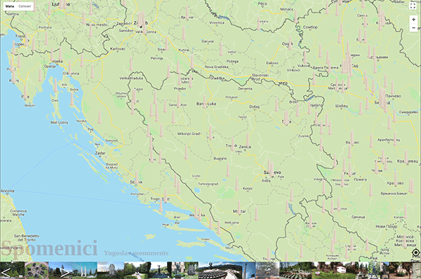

# Spomenici

Yugoslav monuments map.

Visit: [mudroljub.github.io/spomenici](https://mudroljub.github.io/spomenici/)

## TODO

- srediti swipe za desktop
- prevesti url slike u base64 https://stackoverflow.com/questions/17124053/node-js-get-image-from-web-and-encode-with-base64
- utovariti podatke u bazu
- bug: kada nije omogucena lokacija na telefonu, ne radi lociranje, cak iako te browser pita i prihvatis
- url routes for monuments
